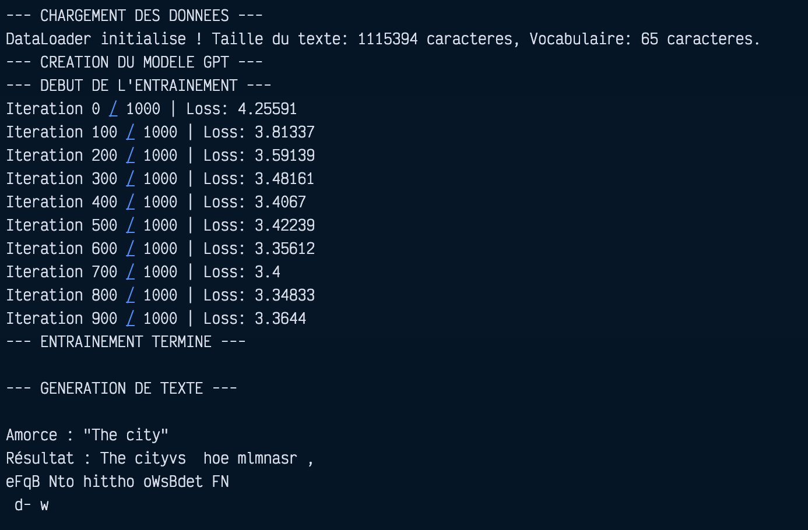

# 🧠 GPT-CUDA: A Transformer from Scratch in C++ and CUDA

[](https://en.cppreference.com/)
[](https://developer.nvidia.com/cuda-toolkit)
[](https://developer.nvidia.com/cublas)
[](./LICENSE)
[]()

**GPT-CUDA** is an educational implementation of a Generative Pre-trained Transformer (GPT) language model, written **entirely from scratch in C++ and CUDA** — no PyTorch, no TensorFlow, no deep learning frameworks. Every matrix multiplication, every activation function, every gradient is computed by hand-written CUDA kernels.

This project was built to break the "black box" of LLMs and understand the hardware-level mechanics of transformers: VRAM management, memory coalescing, thread synchronization, and the raw mathematics of backpropagation.

---

## 📊 Training Results

**Model:** 6 Transformer blocks, 192-dim embeddings, 64-token context (~2.7M parameters)  
**Data:** Shakespeare (1.1M characters, 65-character vocabulary)  
**Hardware:** NVIDIA T4 (Colab), 15,000 iterations, ~9 minutes  



| Metric | Start | End |
|--------|-------|-----|
| Loss | 5.51 | **1.19** ↓ |
| Perplexity | 247 | **3.3** ↓ |
| Text quality | Random | Character-like patterns |

The model learns Shakespearean character distributions and produces statistically plausible sequences. Text quality is limited by the small model size and training duration — this is a proof of concept, not a production LLM.

### Sample Generation (after 15K steps)

```
Prompt: "First Citizen:"
Output: First Citizen: and the state of the common the state of the state...

Prompt: "ROMEO:"
Output: ROMEO: I have the state of the state of the common...
```

---

## 🏗️ Architecture

The project uses an Object-Oriented architecture in C++. Each layer inherits from an abstract `Layer` base class defining a strict contract: `forward()`, `backward()`, and `step()`.

```
GPTModel
├── EmbeddingLayer      — Token embeddings + sinusoidal positional encoding
├── TransformerBlock ×6 — Pre-norm residual blocks
│   ├── RMSNormLayer    — Root Mean Square normalization
│   ├── AttentionLayer  — Multi-head? No, single-head causal self-attention
│   │   ├── LinearLayer — Q, K, V projections
│   │   ├── cuBLAS Sgemm — Q@K^T and Scores@V
│   │   ├── Softmax     — Custom CUDA kernel with shared memory
│   │   └── LinearLayer — Output projection (W_o)
│   └── FeedForwardLayer
│       ├── LinearLayer — Expansion (×4) + GELU
│       └── LinearLayer — Contraction
├── RMSNormLayer        — Final normalization
└── LinearLayer         — LM head: embeddings → vocabulary logits
```

### Key Components

#### Attention (`AttentionLayer.cu`)
- **cuBLAS StridedBatched** for batched Q@K^T and Scores@V
- **Custom CUDA Softmax** with `__shared__` memory parallel reduction
- **Causal masking** via dedicated kernel (upper triangle → -inf)
- **1/√d_k scaling** for stable softmax inputs
- **Full backward pass**: dQ, dK, dV, dScores with softmax Jacobian

#### FeedForward (`FeedForwardLayer.cu`)
- Standard transformer MLP: expansion ×4 + **GELU** activation + contraction
- GELU approximation: `x · σ(1.702x)` via tanh

#### Normalization (`RMSNormLayer.cu`)
- Root Mean Square normalization (more efficient than LayerNorm)
- **Learnable gamma** parameter with Adam optimizer
- Forward: parallel reduction via shared memory + `rsqrtf`
- Backward: exact gradient with reduction

#### Embedding (`EmbeddingLayer.cu`)
- Token embeddings with **Xavier/Glorot uniform initialization** on GPU
- **Sinusoidal positional encoding** (precomputed on CPU, fused on GPU)
- AdamW optimizer with weight decay

#### Optimizer
- **AdamW** with decoupled weight decay on all parameters
- Separate Adam state for weights and biases
- LR schedule: linear warmup → cosine decay to 10%

---

## 🚀 Quick Start

### Prerequisites
- NVIDIA GPU with CUDA toolkit (`nvcc`)
- cuBLAS library (included with CUDA)

### Compile & Train

```bash
# 1. Download training data
wget https://raw.githubusercontent.com/karpathy/char-rnn/master/data/tinyshakespeare/input.txt

# 2. Compile
bash compile.sh

# 3. Train
./gpt_cuda
```

Training produces `training_log.csv` with per-step loss and learning rate.

### Google Colab / Thunder Compute

Use the self-contained notebook: **`GPT_CUDA_v2_Fixed.ipynb`**  
It writes all source files, compiles, trains, and plots the loss curve — just run all cells.

---

## ⚙️ Configuration

Edit hyperparameters in `main.cu`:

```cpp
int context_size = 64;      // Sequence length
int batch_size = 64;        // Batch size
int embedding_dim = 192;    // Embedding dimension
int num_blocks = 6;         // Transformer blocks
float base_lr = 3e-3f;      // Peak learning rate
int total_iterations = 15000;
int warmup_steps = 2000;
```

| VRAM | Suggested Config |
|------|-----------------|
| 4 GB (T4) | `ed=128, blocks=4, bs=64, cs=32` |
| 8 GB | `ed=192, blocks=6, bs=64, cs=64` |
| 16 GB (V100) | `ed=256, blocks=8, bs=128, cs=128` |

---

## 📁 File Structure

| File | Description |
|------|-------------|
| `main.cu` | Training loop, loss, gradient clipping, LR schedule, text generation |
| `GPTModel.cu/.cuh` | GPT model assembly (embedding → blocks → norm → head) |
| `TransformerBlock.cu/.cuh` | Pre-norm residual block (attention + FFN) |
| `AttentionLayer.cu/.cuh` | Causal self-attention with cuBLAS + custom softmax |
| `FeedForwardLayer.cu/.cuh` | 2-layer MLP with GELU |
| `LinearLayer.cu/.cuh` | Linear projection with Xavier init, AdamW, activation |
| `EmbeddingLayer.cu/.cuh` | Token + positional embeddings |
| `RMSNormLayer.cu/.cuh` | RMS normalization with learnable gamma |
| `DataLoader.cpp/.h` | Character-level tokenization, random batch sampling |
| `Layer.cuh` | Abstract base class (forward/backward/step contract) |
| `compile.sh` | Convenience compilation script |
| `GPT_CUDA_v2_Fixed.ipynb` | Self-contained Colab notebook |
| `compilation.txt` | nvcc compilation command reference |

---

## 🔧 Implementation Details

### What's Hand-Written
- ✅ All CUDA kernels (Softmax, RMSNorm forward/backward, GELU, ReLU, AdamW, Xavier init, gradient clipping, embedding lookup, residual add, causal mask, cross-entropy backward)
- ✅ cuBLAS integration for matrix multiplies
- ✅ Full forward + backward passes through all layers
- ✅ Autoregressive text generation with temperature sampling

### What's Not (Yet) Implemented
- Multi-head attention (currently single-head)
- Dropout / regularization
- Gradient checkpointing
- Mixed precision (FP16)
- FlashAttention
- KV caching for inference

### Known Limitations
- **VRAM-heavy**: stores all intermediate activations for backward pass (no gradient checkpointing)
- **Single-head attention**: limits model expressivity
- **Small scale**: designed for educational use, not production training

---

## 🐛 Debugging Notes

During development, the model initially failed to learn (loss stuck at 4.17 = random). The root cause was a **single-line bug** in `EmbeddingLayer.cu:79`:

```cpp
// BUG (v1-v4): only 1/embedding_dim threads launched
int total = batch_size * context_size;  // 4096 threads for 786,432 elements

// FIX (v5): all embedding dimensions computed
int total = batch_size * context_size * embedding_dim;
```

The embedding kernel launched one thread per **token** instead of one per **(token × embedding_dimension)**. Only dimension 0 of each token embedding was filled; the remaining 191 dimensions were uninitialized GPU memory. Every subsequent layer processed 191/192 garbage — the model could learn character frequencies (a 1D problem) but nothing beyond.

---

## 📜 License

MIT License — see [LICENSE](./LICENSE)

---

*Built from scratch. No frameworks. Just CUDA, cuBLAS, and C++.*
